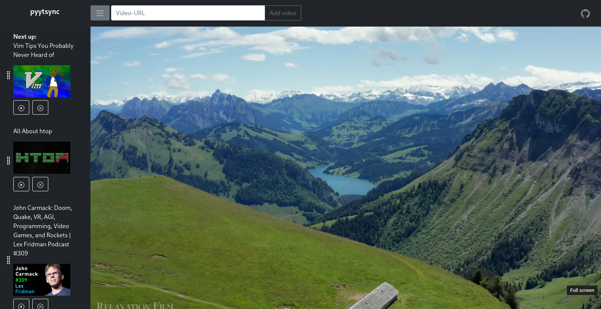

# pyytsync - A simple web app for watching Youtube videos synchronized over multiple user sessions

:heavy_check_mark: User interface: Fast and responsive, implemented with Bootstrap 5 and JavaScript  
:heavy_check_mark: Managing a queue of videos: Add, delete and adjust order via Drag & Drop  
:heavy_check_mark: Deployment: Easily deployable via Docker and Docker-compose  
:heavy_plus_sign: No User-management: The server can only handle a single "Room" of clients, which might be a pro or a con depending on your use case  

# Install

1. `git clone git@github.com:rndxelement/pyytsync.git`
2. Copy `.env.dev` to `.env` and adjust the environment variables
3. Set your Youtube Data API key in `pyytsync/pyytsync/settings.py`

# Build

`docker-compose build`

# Run 

`docker-compose up -d`
